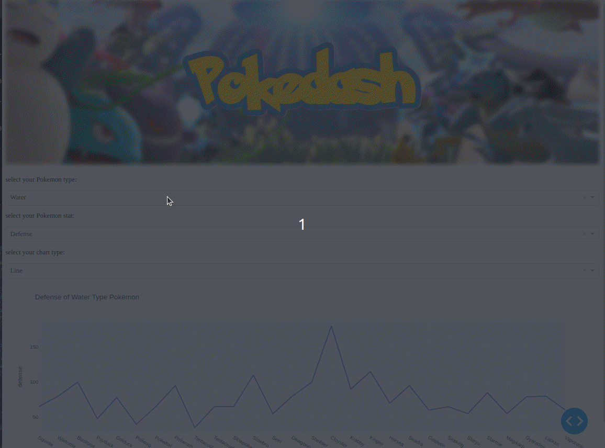

# Poke-Dash: Interactive Pokémon Data Visualization Dashboard

Poke-Dash is an interactive data visualization dashboard built using Plotly, Dash, and pandas. This project demonstrates how to create a dynamic and responsive web application to explore and visualize data on the first 150 Pokémon. With Poke-Dash, you can filter Pokémon by type, select various metrics to display, and choose different types of charts to visualize the data.

## Features

- **Interactive Charts**: Poke-Dash offers a variety of interactive charts, including bar charts, line charts, scatter plots, and more. Users can explore data in an intuitive and engaging way.
- **Responsive Design**: The dashboard is fully responsive, ensuring a seamless experience across different devices, including desktops, tablets, and smartphones.
- **Customizable Style**: Utilizing CSS and Dash's built-in theming, the dashboard features a modern, dark theme with customizable styles.
- **Dynamic Filtering**: Users can filter Pokémon by type and select various metrics to display, allowing for detailed data exploration.

## Technologies Used

- **Dash**: A Python framework for building analytical web applications.
- **Plotly**: A graphing library that makes interactive, publication-quality graphs online.
- **pandas**: A data analysis and manipulation tool.
- **HTML/CSS**: For layout and styling of the web application.

## Installation

1. Clone the repository

2. Change to the project directory

3. Create a virtual environment and activate it
```
python3 -m venv venv
source venv/bin/activate  # On Windows use `venv\Scripts\activate`
```

4. Install the required dependencies
```
pip install -r requirements.txt
```


## Usage

1. Ensure you have the Pokémon data CSV file in the data directory.

2. Run the Dash application:
python app.py

3. Open your web browser and go to http://127.0.0.1:8050 to view the dashboard.

## Project Structure
- **app.py**: The main application file containing the Dash app configuration and callback functions.
- **data/pokemon.csv**: The CSV file containing data on the first 150 Pokémon.
- **assets/styles.css**: Custom CSS styles for the application.
- **assets/banner.jpg**: The main banner image.
- **assets/title.jpg**: The title image used in the dashboard.


## Customization
- CSS Styling: Modify assets/styles.css to change the look and feel of the dashboard.
- Data: Update data/pokemon.csv with new data if needed.
- Chart Types: The available chart types are defined in the chart_functions dictionary in app.py. Add or remove chart types as needed.

# Example Dashboard
Here is a preview of the Poke-Dash dashboard:




## Contributing
Contributions are welcome! Please fork this repository and submit a pull request with your changes.

## License


## Acknowledgments
- Plotly for the amazing graphing library.
- Dash for the powerful web application framework.
- pandas for data manipulation.
